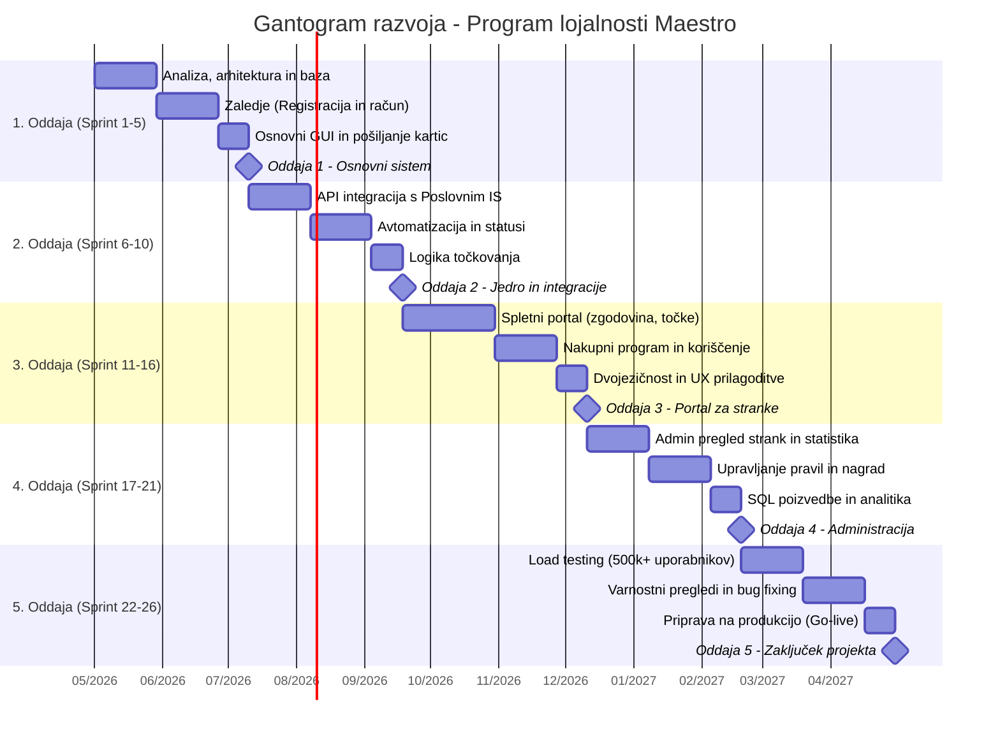

# Načrt razvoja projekta: Program lojalnosti Maestro

Glede na zahtevan časovni okvir enega leta (približno 52 tednov) in ekipo petih razvijalcev, je najboljša praksa uporaba **dotedenskih (2-tedenskih) sprintov**, kar pomeni skupno **26 sprintov**. To ekipi omogoča dovolj časa za razvoj kompleksnejših funkcij znotraj enega cikla, hkrati pa ohranja redne preglede in prilagodljivost.

Projekt je razdeljen na pet smiselnih faz, kjer vsaka oddaja (mejnik) predstavlja zaključen in testiran sklop funkcionalnosti.

---

## 1. Razporeditev ekipe (5 razvijalcev)

Za optimalno delo je predvidena naslednja delitev vlog:
* **2x Zaledni (Backend) razvijalec / Podatkovne baze:** Skrbita za integracijo z Oracle podatkovno bazo, poslovno logiko statusov ter integracijo s poslovnim IS.
* **2x Čelni (Frontend) razvijalec:** Osredotočena na odziven uporabniški vmesnik za portal in administracijo z dvojezično podporo.
* **1x Vodja / Arhitekt / DevOps:** Skrbi za arhitekturo sistema, vodenje sprintov, varnost ter pripravo infrastrukture za visoko obremenjenost (500.000 uporabnikov).

---

## 2. Načrt razvoja po sprintih (26 sprintov = 52 tednov)

### 1. Oddaja: Postavitev arhitekture in varna registracija (Sprinti 1 - 5)
**Cilj:** Vzpostavitev temeljev, podatkovne baze in osnovnega uporabniškega računa.
* **Sprint 1-2:** Analiza in načrtovanje. Postavitev okolij (razvojno, testno, produkcijsko). Načrtovanje podatkovnega modela v obstoječi Oracle bazi.
* **Sprint 3-4:** Razvoj zalednega sistema za varno registracijo strank prek spleta z verifikacijo elektronskega naslova in ustvarjanje uporabniškega računa.
* **Sprint 5:** Osnovni grafični vmesnik za registracijo in prijavo (intuitiven UX). Implementacija sistemskega proženja za pošiljanje fizične kartice.
> **Oddaja 1:** Delujoč proces registracije, prijave in osnovni skelet aplikacije.

### 2. Oddaja: Jedro sistema in integracija s poslovnim IS (Sprinti 6 - 10)
**Cilj:** Povezava s poslovnim sistemom in implementacija ključne poslovne logike.
* **Sprint 6-7:** Vzpostavitev varne povezave in API-jev s primarnim poslovnim IS za pridobivanje mesečnih zneskov nakupov.
* **Sprint 8-9:** Razvoj avtomatiziranih procesov (cron) za mesečni izračun. Implementacija pravil za prehajanje med statusi (osnovni, bronasti, srebrni, zlati) glede na nakupe v preteklih mesecih.
* **Sprint 10:** Implementacija dodeljevanja točk zvestobe glede na status in znesek.
> **Oddaja 2:** Avtomatiziran sistem, ki uspešno in pravilno preračunava statuse ter dodeljuje točke na podlagi surovih podatkov iz trgovine.

### 3. Oddaja: Spletni portal za stranke (Sprinti 11 - 16)
**Cilj:** Strankam omogočiti vpogled v njihove podatke in koriščenje ugodnosti.
* **Sprint 11-12:** Čelni razvoj portala (pregled zbranih točk, trenutni status, zgodovina nakupov).
* **Sprint 13-14:** Razvoj nakupnega programa in sistema za koriščenje zbranih točk.
* **Sprint 15-16:** Implementacija dvojezičnosti (slovenščina in angleščina) na celotnem portalu ter testiranje odzivnosti vmesnika.
> **Oddaja 3:** Popolnoma delujoč spletni portal za končnega uporabnika.

### 4. Oddaja: Administracijski vmesnik (Sprinti 17 - 21)
**Cilj:** Orodja za zaposlene v trgovski verigi Maestro za nadzor in upravljanje programa.
* **Sprint 17-18:** Razvoj pregledovalnika statusov strank za poljubna obdobja in pregleda statistike nakupov.
* **Sprint 19:** Razvoj vmesnika za vnašanje in upravljanje nagrad v nakupnem programu.
* **Sprint 20:** Implementacija modula za dinamično upravljanje pravil – spreminjanje pragov in vrednosti za prehajanje med statusi in nagrajevanje.
* **Sprint 21:** Razvoj vmesnika za izvajanje poljubnih SQL/podatkovnih poizvedb za napredno analitiko.
> **Oddaja 4:** Funkcionalen zaledni portal za administratorje.

### 5. Oddaja: Obremenitveno testiranje, optimizacija in produkcija (Sprinti 22 - 26)
**Cilj:** Priprava na masovno uporabo in lansiranje produkta.
* **Sprint 22-23:** Skalabilnostno in obremenitveno testiranje. Sistem mora tekoče podpirati vsaj 500.000 uporabnikov in imeti arhitekturo pripravljeno za širitev izven Slovenije.
* **Sprint 24:** Varnostni pregledi (penetration testing), predvsem preverjanje varnosti baze podatkov in uporabniških računov.
* **Sprint 25:** Odpravljanje odkritih hroščev (bug fixing) in zadnji popravki UX/UI na podlagi testiranj. Priprava projektne dokumentacije.
* **Sprint 26:** "Go-live" faza. Namestitev v produkcijsko okolje in predaja sistema naročniku.
> **Oddaja 5:** Zaključen projekt, pripravljen na realno uporabo.
>
> # Časovni načrt projekta (Gantogram)

Za lažjo predstavitev in sledenje napredku je celoten enoletni razvojni cikel (26 sprintov) razdeljen na 5 glavnih mejnikov (oddaj).

