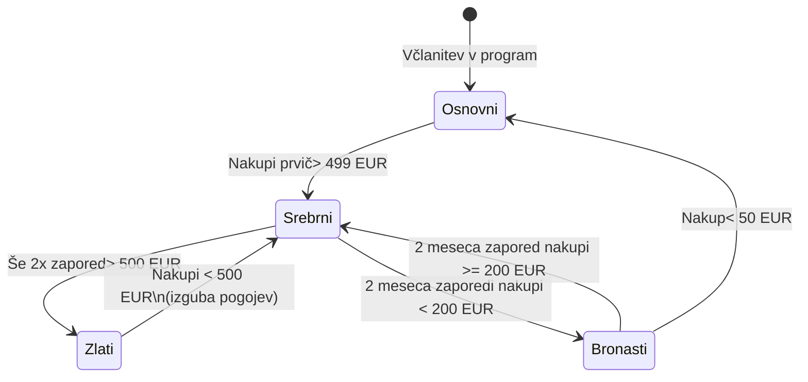

# Specifikacija zahtev za program lojalnosti Maestro

**Avtor:** Mattia Lauzana
**Predmet:** Razvoj informacijskih sistemov

### Zgodovina različic
| Različica | Datum | Avtor | Opis sprememb |
| :--- | :--- | :--- | :--- |
| 1.0 | 18. 03. 2026 | Mattia Lauzana | Začetni osnutek specifikacije zahtev za razvoj rešitve |

---

## 1. Kratek opis sistema
V trgovski verigi Maestro bi želeli vpeljati program lojalnosti. Z njim želimo motivirati stranke, da čim več kupijo v naši trgovski verigi. Portal si predstavljamo kot spletno aplikacijo, prek katere lahko nekdo, ki je član programa, pregleduje svoje točke zvestobe ter jih koristi.

## 2. Funkcionalne zahteve

### Registracija in upravljanje uporabnikov
* Vsaka stranka bo lahko kadarkoli zaprosila za vključitev v program.
* Strankam bi želeli ponuditi možnost, da se v program registrirajo prek spleta.
* Prek spleta bi podali svoje osebne podatke in se registrirali.
* To mora biti narejeno tako, da bo varno, v smislu, da se ne more nekdo registrirati z elektronskim naslovom, ki ni njegov.
* Ob registraciji bi moral vsak uporabnik dobiti svoj uporabniški račun, ki ga bo lahko kasneje koristil za identifikacijo ob vstopu na portal.
* Dobila bo kartico lojalnosti, ki bi jo strankam poslali po navadni pošti.

### Upravljanje statusov strank
* Imeli bi radi več nivojev lojalnosti, in sicer: osnovni, bronasti, srebrni in zlati.
* Ob včlanitvi ima stranka status osnovni.
* Ko z nakupi preteklega meseca prvič preseže 499 EUR, dobi status srebrni.
* Če še dvakrat preseže tak znesek (>500), pride v status zlati.
* Da stranka ohranja status srebrni, mora njen znesek nakupa znašati vsaj 200 EUR, za ohranjanje statusa zlati pa vsaj 500 EUR.
* Če stranka nima pogojev za ohranitev statusa zlati, pridobi status srebrni.
* Če stranka nima pogojev za ohranitev statusa srebrni in sicer dva meseca zapored, dobi status bronasti in v njem ostane, vse dokler dva zaporedna meseca ne opravi najmanj za 200 EUR nakupov oziroma, če opravi nakup pod 50 EUR, pride nazaj v osnovni status.
* Spodnji diagram prikazuje pravila prehajanja med posameznimi nivoji lojalnosti:

### Izračun in dodeljevanje točk zvestobe
* Točke zvestobe bi računali enkrat na mesec za pretekli mesec.
* Ko stranki dodeljujemo točke zvestobe, ji najprej spremenimo status, v kolikor izpolnjuje pogoje in šele potem dodelimo ustrezno število točk.
* Več kot bi znašali njeni nakupi, več točk bi stranka dobila.
* Radi pa bi imeli možnost, da ta pravila še kasneje sami spreminjamo.

**Matrika za dodeljevanje točk zvestobe:**
| Znesek nakupov | Bronasti | Osnovni | Srebrni | Zlati |
| :--- | :--- | :--- | :--- | :--- |
| **Do 200 EUR** | 0 točk | 5 točk | 7.5 točk | 10 točk |
| **Med 200 EUR in 1000 EUR** | 5 točk | 10 točk | 15 točk | 20 točk |
| **Nad 1000 EUR** | 10 točk | 20 točk | 30 točk | 40 točk |

### Spletni portal za stranke
Spletna aplikacija oziroma portal bo strankam omogočal vsaj naslednje možnosti:
* pregled zbranih točk zvestobe
* koriščenje točk
* pregled nakupnega programa
* pregled zneskov nakupov

### Administracijski vmesnik
Portal naj omogoča tudi administracijo, pod čemer si predstavljamo vsaj naslednje možnosti:
* pregled statusov strank za poljubno obdobje
* pregled statistike nakupov
* poljubne poizvedbe po podatkovni bazi
* upravljanje s programom, ki je na voljo kot nagrada za točke zvestobe
* upravljanje pravil v zvezi s prehajanjem med statusi ter nagrajevanjem

## 3. Tehnične zahteve
* **Skalabilnost in obseg:** Pričakujemo, da bo v program vključenih vsaj 70% naših strank, kar pomeni dobri 500.000 oseb. Informacijsko podporo bi želeli tržiti tudi izven Slovenije, zato naj bo narejena tako, da bo omogočala tudi bistveno večje število uporabnikov.
* **Jezikovna podpora:** Vsa informacijska podpora naj bo narejena tako, da bo podpirala dva jezika, slovenščino in angleščino.
* **Baza podatkov:** V podjetju imamo podatkovno bazo Oracle ter licence zanjo. Želeli bi jo uporabiti tudi za potrebe IS za podporo programu lojalnosti.
* **Uporabniški vmesnik:** Naj bo narejen tako, da bo čim bolj intuitiven. Uporabljene naj bodo sodobne tehnologije.

## 4. Vmesniki
* **Poslovni IS:** Podatek o znesku opravljenih nakupov bo moč dobiti iz poslovnega IS, ki ga trgovska veriga uporablja.

## 5. Slovar izrazov
* **Program lojalnosti:** Sistem motiviranja strank, da čim več kupijo v trgovski verigi.
* **Točke zvestobe:** Točke, ki jih stranka zbira z nakupi.
* **Poslovni IS:** Sistem, ki ga trgovska veriga uporablja in iz katerega se pridobiva podatek o znesku nakupov.
