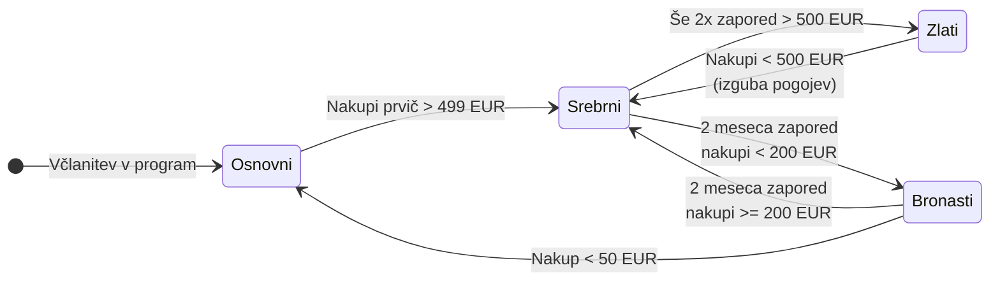

**Avtor:** Mattia Lauzana
**Predmet:** Razvoj informacijskih sistemov

### Zgodovina različic
| Različica | Datum | Avtor | Opis sprememb |
| :--- | :--- | :--- | :--- |
| 1.0 | 18. 03. 2026 | Mattia Lauzana | Začetni osnutek specifikacije zahtev za razvoj rešitve |
| 1.1 | 25. 03. 2026 | Mattia Lauzana | Dodan diagram primerov uporabe in funkcionalno dekompozicijo |
| 1.2 | 1. 04. 2026 | Mattia Lauzana | Podatkovni model in maske za uporabnika |
| 1.3 | 8. 04. 2026 | Mattia Lauzana | Dodana tabela analiz |

---

## 1. Kratek opis sistema
V trgovski verigi Maestro bi želeli vpeljati program lojalnosti. Z njim želimo motivirati stranke, da čim več kupijo v naši trgovski verigi. Sistem bo sestavljen iz dveh glavnih sklopov:

1. **Zaledni sistem:** Avtomatiziran sistem, ki bo vsak mesec (na podlagi podatkov iz poslovnega IS-a) preračunal zneske preteklih nakupov stran. Najprej bo strankam glede na vnaprej določena pravila posodobil njihov status (osnovni, bronasti, srebrni, zlati), nato pa jim glede na status in znesek nakupov dodelil ustrezno število točk zvestobe.  
2. **Spletna aplikacija (Portal):** Prek spletnega portala bodo lahko stranke (člani programa) dostopale do svojega uporabniškega računa, pregledujele zbrane točke zvestobe ter jih koristile za različne nagrade. Portal bo poleg uporabniškega dela vključeval tudi administracijski vmesnik za upravljanje program.

## 2. Funkcionalne zahteve

| ID | Funkcija / Opis zahteve |
| :--- | :--- |
| **Z1** | **Varna registracija in prijava:** Spletna včlanitev z varnim preverjanjem e-maila in ustvarjanjem uporabniškega računa. Dodelitev "Osnovnega" statusa. |
| **Z2** | **Izdaja kartice lojalnosti:** Evidentiranje za sistemski proces pošiljanja fizične kartice po pošti. |
| **Z3** | **Mesečni preračun statusov:** Sistemsko preverjanje zneskov nakupov iz preteklega meseca in dodeljevanje ustreznih nivojev lojalnosti. |
| **Z4** | **Izračun točk zvestobe:** Dodeljevanje točk glede na določen status in znesek nakupa (po tabeli točkovanja). Izvede se po preračunu statusa. |
| **Z5** | **Pregled in koriščenje točk:** Omogočanje stranki, da pregleduje stanje točk in jih koristi za nagrade iz nakupnega programa. |
| **Z6** | **Pregled zneskov nakupov:** Stranka lahko na portalu preveri zgodovino svojih opravljenih nakupov. |
| **Z7** | **Pregled statusov strank:** Administrator lahko pregleduje bazo strank, filtrira po obdobjih in trenutnih statusih. |
| **Z8** | **Statistika nakupov:** Krovni pregled administracije nad zneski nakupov in uspešnostjo programa lojalnosti. |
| **Z9** | **SQL poizvedbe:** Zmožnost izvajanja poljubnih neposrednih poizvedb po podatkovni bazi za napredno analitiko. |
| **Z10**| **Upravljanje nakupnega programa:** Administrator lahko dodaja, ureja ali briše nagrade iz kataloga. |
| **Z11**| **Upravljanje pravil točkovanja:** Možnost dinamičnega spreminjanja meja za status (zneski) in števila dodeljenih točk. |

Poslovna logika: Pravila prehajanja med statusi (Vezano na Z3 in Z11)
Spodnji diagram ponazarja življenjski cikel in prehode statusa stranke na podlagi mesečnega zneska nakupov. To logiko bo zaledni sistem obdelal vsak mesec pred samim dodeljevanjem točk (Z4).

Dodeljevanje točk glede na status (Z4)

| Znesek nakupov | Bronasti | Osnovni | Srebrni | Zlati |
| **Do 200 EUR** | 0 točk | 5 točk | 7.5 točk | 10 točk |
| **Med 200 EUR in 1000 EUR** | 5 točk | 10 točk | 15 točk | 20 točk |
| **Nad 1000 EUR** | 10 točk | 20 točk | 30 točk | 40 točk |

## 3. Nefunkcionalne zahteve
| ID | Tehnična zahteva |
| :--- | :--- |
| **NZ1** |**Skalabilnost:** Sistem mora podpirati najmanj 500.000 uporabnikov (70% trenutnih strank) in biti zasnovan tako, da omogoča enostavno širitev za bistveno večje število uporabnikov za potrebe trženja v tujini. |
| **NZ2** | **Jezikovna podpora:** Uporabniški vmesnik (portal in administracija) mora podpirati slovenščino in angleščino. |
| **NZ3** | **Podatkovna baza:** Kot primarna relacijska podatkovna baza se mora uporabiti Oracle Database (že obstoječe licence v podjetju). |
| **NZ4** | **Uporabniški vmesnik (UX/UI):** Vmesnik mora biti intuitiven, odziven (responsive) in razvit z uporabo sodobnih spletnih tehnologij. |

## 4. Vmesniki
* **Poslovni IS:** Podatek o znesku opravljenih nakupov bo moč dobiti iz poslovnega IS, ki ga trgovska veriga uporablja.

## 5. Slovar izrazov
* **Program lojalnosti:** Sistem motiviranja strank, da čim več kupijo v trgovski verigi.
* **Točke zvestobe:** Točke, ki jih stranka zbira z nakupi.
* **Nivo lojalnosti (Status):** Kategorija člana (osnovni, bronasti, srebrni, zlati), v katero je stranka uvrščena glede na znesek preteklih nakupov. Status neposredno vpliva na število prejetih točk.
* **Kartica lojalnosti:** Fizični identifikator, ki ga stranka dobi po navadni pošti po uspešni včlanitvi v program.
* **Uporabniški račun:** Digitalna identiteta stranke, ki jo ta pridobi ob varni spletni registraciji in služi za identifikacijo pri vstopu na portal.
* **Portal za stranke (Spletna aplikacija):** Spletni vmesnik, ki članom programa omogoča pregled zbranih točk, koriščenje točk, pregled nakupov in nakupnega programa.
* **Administracija (Admin vmesnik):** Zavarovan del portala, namenjen zaposlenim v trgovski verigi za upravljanje pravil, nagrad, strank in pregled statistike.Poslovni IS: Zaledni (primarni) informacijski sistem trgovske verige, iz katerega sistem lojalnosti pridobiva podatke o zneskih opravljenih nakupov.
* **Nakupni program (Katalog nagrad):** Nabor nagrad oziroma ugodnosti, ki so na voljo strankam v zameno za njihove zbrane točke zvestobe.

## 6. Diagram primerov uporabe

Spodnji diagram na visoki ravni prikazuje glavne akterje v sistemu in njihove ključne interakcije (primere uporabe) s spletnim portalom, administracijskim vmesnikom ter zalednim sistemom.

