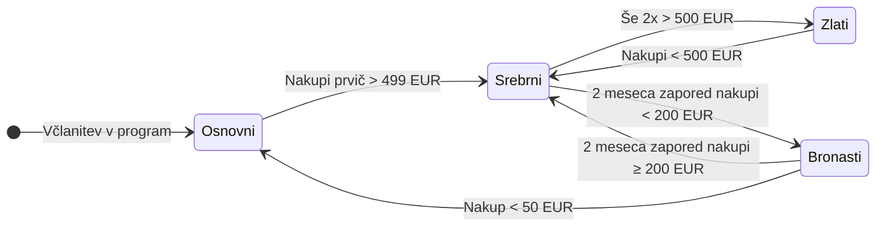

**Avtor:** Mattia Lauzana
**Predmet:** Razvoj informacijskih sistemov

### Zgodovina različic
| Različica | Datum | Avtor | Opis sprememb |
| :--- | :--- | :--- | :--- |
| 1.0 | 18. 03. 2026 | Mattia Lauzana | Začetni osnutek specifikacije zahtev za razvoj rešitve |
| 1.1 | 25. 03. 2026 | Mattia Lauzana | Dodan diagram primerov uporabe in funkcionalno dekompozicijo |
| 1.2 | 1. 04. 2026 | Mattia Lauzana | Podatkovni model in maske za uporabnika |
| 1.3 | 8. 04. 2026 | Mattia Lauzana | Dodana tabela analiz |
| 1.4 | 6. 05. 2026 | Mattia Lauzana | Spremenjen diagram primerov uporabe |
| 1.5 | 16. 05. 2026 | Mattia Lauzana | Posodobitev opisa sistema, funkcionalnih zahtev, nefunkcionalnih zahtev, vmesnikov |


## 1. Kratek opis sistema
**Sistem za program lojalnosti Maestro** je celovita informacijska rešitev, namenjena motivaciji strank k večjim in pogostejšim nakupom v trgovski verigi Maestro. Sistem temelji na štirih nivojih lojalnosti (osnovni, bronasti, srebrni, zlati), mesečnem nagrajevanju s točkami zvestobe ter sodobnem spletnem portalu za stranke in administratorje. Sistem bo sestavljen iz dveh glavnih sklopov:

1. **Zaledni sistem:** Avtomatiziran sistem, ki bo vsak mesec (na podlagi podatkov iz poslovnega IS-a) preračunal zneske preteklih nakupov stran. Najprej bo strankam glede na vnaprej določena pravila posodobil njihov status (osnovni, bronasti, srebrni, zlati), nato pa jim glede na status in znesek nakupov dodelil ustrezno število točk zvestobe.  
2. **Spletna aplikacija (Portal):** Prek spletnega portala bodo lahko stranke (člani programa) dostopale do svojega uporabniškega računa, pregledujele zbrane točke zvestobe ter jih koristile za različne nagrade. Portal bo poleg uporabniškega dela vključeval tudi administracijski vmesnik za upravljanje program.

## 2. Funkcionalne zahteve

| ID | Funkcionalna zahteva | Opis zahteve | MoSCoW |
|---|---|---|---|
| **FZ-01** | Varna registracija in prijava | Spletna včlanitev z varnim preverjanjem e-maila (double opt-in) in ustvarjanjem uporabniškega računa. Ob registraciji se stranki dodeli status »Osnovni«. | Must have |
| **FZ-02** | Izdaja kartice lojalnosti | Evidentiranje zahtevka za sistemski proces pošiljanja fizične kartice lojalnosti po pošti ob uspešni registraciji člana. | Must have |
| **FZ-03** | Mesečni preračun statusov | Sistemsko preverjanje zneskov nakupov iz preteklega meseca in samodejno dodeljevanje ustreznih nivojev lojalnosti glede na veljavna pravila prehajanja. | Must have |
| **FZ-04** | Izračun točk zvestobe | Dodeljevanje točk zvestobe glede na aktualni status člana in znesek nakupa po tabeli točkovanja. Izvede se vedno po preračunu statusa (FZ-03). | Must have |
| **FZ-05** | Pregled in koriščenje točk | Stranki se na portalu omogoči pregled trenutnega stanja in zgodovine točk ter uveljavitev točk za nagrade iz nakupnega programa. | Must have |
| **FZ-06** | Pregled zneskov nakupov | Stranka lahko na portalu preveri zgodovino svojih opravljenih nakupov, razčlenjeno po mesecih. | Must have |
| **FZ-07** | Pregled statusov strank | Administrator lahko pregleduje bazo članov ter filtrira po časovnih obdobjih in trenutnih nivojih lojalnosti. | Must have |
| **FZ-08** | Statistika in poročanje | Administrativni portal nudi krovni pregled nad zneski nakupov in uspešnostjo programa z agregiranimi podatki za poslovne analize. | Must have |
| **FZ-09** | SQL poizvedbe | Pooblaščeni administrator lahko izvaja poljubne neposredne poizvedbe po podatkovni bazi za napredno analitiko. | Must have |
| **FZ-10** | Upravljanje nakupnega programa | Administrator dodaja, ureja, deaktivira ali briše nagrade iz kataloga ter določa njihovo vrednost v točkah. | Must have |
| **FZ-11** | Upravljanje pravil točkovanja in statusov | Dinamično spreminjanje meja za posamezni status (zneski nakupov) in števila dodeljenih točk prek administracijskega vmesnika, brez posegov v izvorno kodo. | Must have |
| **FZ-12** | Integracija s poslovnim sistemom (ERP) | Samodejni mesečni uvoz podatkov o nakupih posameznih članov iz zunanjega poslovnega informacijskega sistema. | Must have |
| **FZ-13** | Upravljanje računov in avtorizacija | Upravljanje sej (prijava, odjava, sprememba gesla) in strogo ločevanje dostopnih pravic med vlogama »Stranka« in »Administrator«. | Must have |
| **FZ-14** | Zgodovina sprememb statusov | Vodenje revizijske evidence o vseh spremembah nivojev lojalnosti za posameznega člana — kdaj in zakaj se je status spremenil. | Must have |
| **FZ-15** | Večjezičnost (lokalizacija) | Celoten uporabniški in administrativni portal podpirata slovenščino in angleščino z možnostjo naknadnega dodajanja jezikovnih paketov. | Must have |
| **FZ-16** | Sistemska obvestila | Sistem generira in pošilja obvestila članom ob ključnih dogodkih, npr. ob spremembi statusa ali posodobitvi pravil programa. | Should have |

# 2.2 Poslovna logika programa lojalnosti

## 2.2.1 Upravljanje statusov uporabnikov

Sistem podpira štiri nivoje lojalnosti: **osnovni**, **bronasti**, **srebrni** in **zlati**. Ob registraciji v program lojalnosti vsak uporabnik samodejno pridobi status **osnovni**. Napredovanje in ohranjanje statusov temelji na vrednosti mesečnih nakupov ter zgodovini doseganja določenih pragov.

#### Pravila napredovanja

- Uporabnik pridobi status **srebrni**, ko vrednost njegovih nakupov v posameznem obračunskem obdobju prvič preseže **499 EUR**.
- Uporabnik pridobi status **zlati**, ko v treh različnih obračunskih obdobjih preseže prag **500 EUR** mesečnih nakupov.

#### Pravila ohranjanja statusa

- Za ohranitev statusa **srebrni** mora uporabnik v posameznem mesecu ustvariti najmanj **200 EUR** nakupov.
- Za ohranitev statusa **zlati** mora uporabnik v posameznem mesecu ustvariti najmanj **500 EUR** nakupov.

#### Pravila znižanja statusa

- Če uporabnik s statusom **zlati** ne doseže pogoja za ohranitev, se njegov status zniža na **srebrni**.
- Če uporabnik s statusom **srebrni** dva zaporedna meseca ne doseže **200 EUR** nakupov, se njegov status zniža na **bronasti**.

#### Posebna pravila za bronasti status

Uporabnik ostane v statusu **bronasti**, dokler ne izpolni enega od naslednjih pogojev:

- dva zaporedna meseca doseže najmanj **200 EUR** nakupov → status se povrne na **srebrni**,
- v posameznem obračunskem obdobju opravi manj kot **50 EUR** nakupov → status se ponastavi na **osnovni**.

## 2.2.2 Obračun statusov in točk

#### Mesečni obračun

Izračun točk zvestobe in posodobitev statusov se izvajata **enkrat mesečno** za preteklo obračunsko obdobje. Obračun poteka kot sistemski proces v ozadju in ne sme vplivati na razpoložljivost ali odzivnost portala za člane.

#### Vrstni red izvajanja

Zaporedje korakov pri mesečnem obračunu je strogo določeno:

1. Sistem iz poslovnega IS prevzame podatke o nakupih za preteklo obračunsko obdobje.
2. Sistem preveri pogoje za spremembo statusa vsakega uporabnika in status po potrebi posodobi.
3. Sistem dodeli točke zvestobe glede na **novi** (že posodobljeni) status uporabnika.

#### Poslovna pravila obračuna

- Točke se vedno dodelijo na podlagi statusa, ki velja **po** morebitni spremembi, ne pred njo.
- Vsa pravila za napredovanje, ohranjanje in znižanje statusov ter vrednosti točk morajo biti konfigurabilna prek administrativnega vmesnika (FZ-11) brez posegov v izvorno kodo.

---

## 2.2.3 Pravila dodeljevanja točk

Število dodeljenih točk je odvisno od skupnega zneska nakupov v obračunskem obdobju in trenutnega statusa uporabnika. Vrednosti v spodnji tabeli so privzete in nastavljive prek administracijskega vmesnika (FZ-11).

| Znesek nakupov | Bronasti | Osnovni | Srebrni | Zlati |
|---|---|---|---|---|
| **Do 200 EUR** | 0 točk | 5 točk | 7,5 točk | 10 točk |
| **Med 200 EUR in 1.000 EUR** | 5 točk | 10 točk | 15 točk | 20 točk |
| **Nad 1.000 EUR** | 10 točk | 20 točk | 30 točk | 40 točk |

---

## 2.2.4 Diagram prehajanja med statusi

Spodnji diagram prikazuje vse možne prehode med statusi lojalnosti glede na mesečno nakupno aktivnost uporabnika.



## 3. Nefunkcionalne zahteve 

| ID | Kategorija | Opis zahteve | MoSCoW |
|---|---|---|---|
| **NZ-01** | Skalabilnost | Sistem mora podpirati najmanj **500.000 aktivnih članov** ter omogočati horizontalno razširljivost za bistveno večje število uporabnikov zaradi potencialne širitve na tuje trge. | Must have |
| **NZ-02** | Jezikovna podpora | Sistem mora podpirati najmanj **slovenski** in **angleški** jezik. Lokalizirani morajo biti portal za člane, administrativni modul ter sistemska obvestila. | Must have |
| **NZ-03** | Podatkovna baza | Kot primarna relacijska podatkovna baza se uporablja **Oracle Database**, za katero ima naročnik obstoječe licence. | Must have |
| **NZ-04** | Varnost — avtentikacija | Sistem mora omogočati varno registracijo in prijavo uporabnikov. Ob registraciji mora biti izvedena verifikacija lastništva elektronskega naslova uporabnika. | Must have |
| **NZ-05** | Varnost — avtorizacija | Sistem mora podpirati ločevanje uporabniških vlog najmanj na: član programa, administrator in operater. Dostop do funkcionalnosti mora biti omejen glede na vlogo uporabnika. | Must have |
| **NZ-06** | Varnost komunikacije | Vsa komunikacija med uporabniškimi odjemalci in strežniškimi komponentami mora potekati prek varnega protokola HTTPS/TLS. | Must have |
| **NZ-07** | GDPR skladnost | Sistem mora zagotavljati skladnost z uredbo GDPR, vključno z upravljanjem soglasij, možnostjo izbrisa osebnih podatkov in zaščito občutljivih informacij. | Must have |
| **NZ-08** | Razpoložljivost | Sistem mora zagotavljati najmanj **99,5 % razpoložljivost** brez upoštevanja načrtovanih vzdrževalnih posegov. | Should have |
| **NZ-09** | Odzivnost | Uporabniški portal mora zagotavljati odzivni čas nalaganja strani manj kot **2 sekundi** pri običajnih obremenitvah sistema. | Should have |
| **NZ-10** | Zmogljivost obdelave | Mesečni obračun točk in posodobitev statusov za vse uporabnike mora biti izveden v okviru predvidenega obračunskega okna brez vpliva na delovanje portala. | Must have |
| **NZ-11** | Konfigurabilnost poslovnih pravil | Pravila za dodeljevanje točk, pragove statusov in nagrajevalne pogoje mora biti mogoče spreminjati prek administrativnega vmesnika brez poseganja v izvorno kodo sistema. | Must have |
| **NZ-12** | Revizijska sled | Sistem mora beležiti vse pomembne poslovne dogodke, vključno s spremembami statusov, dodeljevanjem točk, spremembami pravil in administratorskimi akcijami. | Must have |
| **NZ-13** | Uporabniška izkušnja | Uporabniški vmesnik mora biti intuitiven, pregleden in prilagojen uporabi na namiznih ter mobilnih napravah. | Should have |
| **NZ-14** | Integracijska podpora | Sistem mora omogočati integracijo z zunanjimi sistemi prek standardnih integracijskih vmesnikov. | Must have |
| **NZ-15** | Varnostno kopiranje in obnova | Zagotovljeno mora biti redno varnostno kopiranje podatkov ter možnost obnove sistema v primeru napake ali izgube podatkov. | Should have |

## 4. Vmesniki

| Sistem | Namen integracije |
|---|---|
| **ERP / Poslovni IS** | Mesečni prevzem podatkov o zneskih nakupov po posameznem članu. Podprti formati se dogovorijo v fazi tehnične analize (REST API, SOAP, batch CSV/XML ali direktna DB integracija). |
| **POS sistemi** | Evidenca transakcij na prodajnih mestih za namen sledenja nakupom. |
| **E-poštni sistem** | Pošiljanje aktivacijskih sporočil (double opt-in), obvestil ob spremembi statusa ter marketinških vsebin. |
| **Sistem za tisk in dostavo kartic** | Posredovanje podatkov za tisk in fizično pošiljanje kartice lojalnosti novim članom ob registraciji. |
| **Identity Provider (IdP)** | Avtentikacija in upravljanje identitet uporabnikov z možnostjo SSO. Integracija je opcijska glede na obstoječo infrastrukturo naročnika. |
| **Analitični sistemi** | Izvoz agregiranih podatkov o nakupih, statusih in točkah za namene poslovne analitike in poročanja. |

## 4.1 Prihodnje integracije

| Sistem | Namen integracije |
|---|---|
| **Mobilna aplikacija** | Razširitev portala za člane na mobilno platformo (iOS/Android) prek obstoječega API sloja. |
| **Plačilni sistemi** | Neposredno beleženje transakcij ob plačilu za takojšnje dodeljevanje točk brez zakasnitve mesečnega obračuna. |
| **Zunanji partnerji za nagrade** | Integracija z zunanjimi ponudniki nagrad (kuponi, turistične agencije, partnerske trgovine). |
| **SMS gateway** | Pošiljanje obvestil prek SMS sporočil kot alternativa ali dopolnitev e-poštnemu kanalu. |


## 5. Slovar izrazov

| Izraz | Definicija |
|---|---|
| **Program lojalnosti** | Strukturiran sistem motiviranja strank k ponavljajočim nakupom v trgovski verigi z mehanizmom zbiranja in unovčevanja točk zvestobe. |
| **Točke zvestobe** | Digitalne enote vrednosti, ki jih stranka pridobiva z mesečnimi nakupi in jih uveljavlja za nagrade iz kataloga. |
| **Nivo lojalnosti (status)** | Kategorija člana (osnovni, bronasti, srebrni, zlati), v katero je stranka uvrščena glede na znesek preteklih nakupov. Status neposredno vpliva na število prejetih točk. |
| **Kartica lojalnosti** | Fizični identifikator, ki ga stranka prejme po pošti ob uspešni včlanitvi v program in ga uporablja za identifikacijo pri nakupih. |
| **Uporabniški račun** | Digitalna identiteta stranke, pridobljena ob varni spletni registraciji, ki služi za prijavo in dostop do portala za člane. |
| **Portal za člane** | Spletna aplikacija, ki registriranim članom omogoča pregled zbranih točk, koriščenje nagrad, vpogled v zgodovino nakupov ter pregled nakupnega programa. |
| **Administrativni vmesnik** | Zavarovan del portala, namenjen pooblaščenim zaposlenim trgovske verige za upravljanje pravil točkovanja, kataloga nagrad, baze strank in pregled statistik. |
| **Poslovni IS (ERP)** | Primarni zaledni informacijski sistem trgovske verige, iz katerega sistem lojalnosti mesečno pridobiva podatke o zneskih opravljenih nakupov po posameznem članu. |
| **Katalog nagrad** | Nabor nagrad in ugodnosti, ki so članom na voljo v zameno za zbrane točke zvestobe. |
| **Double opt-in** | Postopek, pri katerem mora stranka ob registraciji potrditi lastništvo e-poštnega naslova s klikom na potrditveno povezavo, preden je njen račun aktiviran. |
| **Obračunsko obdobje** | Koledarski mesec, za katerega se izvaja mesečni izračun točk in posodobitev statusov članov. |
| **MoSCoW** | Metoda prioritizacije zahtev: Must have (nujno), Should have (zaželeno), Could have (možno), Won't have (izključeno v tej fazi). |


## 6. Diagram primerov uporabe

Spodnji diagram na visoki ravni prikazuje glavne akterje v sistemu in njihove ključne interakcije (primere uporabe) s spletnim portalom, administracijskim vmesnikom ter zalednim sistemom.
```mermaid
flowchart LR
    %% Akterji
    Stranka(("👤\nStranka"))
    Admin(("👨‍💼\nAdministrator"))
    PoslovniIS[["«system»\nPoslovni IS"]]
    Cron(("⏱️\nCron\n(Časovni sprožilec)"))

    %% Skupina: Portal za stranke
    subgraph Portal ["Portal za stranke"]
        direction TB
        UC1([UC1: Registracija prek spleta])
        UC1a([UC1a: Izdaja kartice lojalnosti])
        UC1b([UC1b: Verifikacija e-pošte])

        UC2([UC2: Pregled zbranih točk])

        UC3([UC3: Koriščenje točk])
        UC3a([UC3a: Pregled zgodovine koriščenj])

        UC4([UC4: Pregled nakupnega programa])
        UC4a([UC4a: Filtriranje po kategorijah])

        UC5([UC5: Pregled zneskov nakupov])
        UC5a([UC5a: Filtriranje po obdobjih])
    end

    %% Skupina: Administracijski vmesnik
    subgraph AdminVmesnik ["Administracijski vmesnik"]
        direction TB
        UC6([UC6: Pregled statusov strank])
        UC6a([UC6a: Filtriranje po statusu])
        UC6b([UC6b: Iskanje po strankah])

        UC7([UC7: Statistika nakupov])
        UC7a([UC7a: Filtriranje po obdobjih])
        UC7b([UC7b: Izvoz podatkov])

        UC9([UC9: Upravljanje z nagradami])
        UC9a([UC9a: Dodajanje nagrade])
        UC9b([UC9b: Urejanje nagrade])
        UC9c([UC9c: Deaktivacija nagrade])

        UC10([UC10: Upravljanje pravil in točkovanja])
        UC10a([UC10a: Urejanje pogojev za status])
        UC10b([UC10b: Urejanje točkovnika])

        UC8([UC8: Poljubne poizvedbe po bazi])
        UC11([UC11: Branje iz Oracle baze])
    end

    %% Skupina: Varnost in dostop
    subgraph Varnost ["Varnost in dostop"]
        direction LR
        UC_PS([Prijava stranke])
        UC_PA([Prijava administratorja])
        UC_PG([Ponastavitev gesla])
        
        UC_PG -. "«extend»" .-> UC_PS
    end

    %% Skupina: Zaledni sistem
    subgraph Zaledje ["Zaledni sistem"]
        direction TB
        UC12([UC12: Zajem zneskov nakupov])
        UC13([UC13: Preračun statusov in točk])
        UC13a([UC13a: Ugotavljanje statusa])
        UC13b([UC13b: Dodelitev točk])
        UC13c([UC13c: Obvestilo stranki])
    end

    %% --- POVEZAVE AKTERJEV ---
    
    Stranka --- UC1
    Stranka --- UC2
    Stranka --- UC3
    Stranka --- UC4
    Stranka --- UC5

    Admin --- UC6
    Admin --- UC7
    Admin --- UC9
    Admin --- UC10
    Admin --- UC8

    Cron --- UC12
    PoslovniIS --- UC12

    %% --- RELACIJE INCLUDE & EXTEND ---

    %% Portal
    UC1 -. "«include»" .-> UC1a
    UC1 -. "«include»" .-> UC1b
    UC3a -. "«extend»" .-> UC3
    UC4a -. "«extend»" .-> UC4
    UC5a -. "«extend»" .-> UC5
    
    UC2 -. "«include»" .-> UC_PS
    UC3 -. "«include»" .-> UC_PS
    UC4 -. "«include»" .-> UC_PS
    UC5 -. "«include»" .-> UC_PS

    %% Admin
    UC6a -. "«extend»" .-> UC6
    UC6b -. "«extend»" .-> UC6
    UC7a -. "«extend»" .-> UC7
    UC7b -. "«extend»" .-> UC7
    UC9a -. "«extend»" .-> UC9
    UC9b -. "«extend»" .-> UC9
    UC9c -. "«extend»" .-> UC9
    UC10a -. "«extend»" .-> UC10
    UC10b -. "«extend»" .-> UC10
    UC8 -. "«include»" .-> UC11

    UC6 -. "«include»" .-> UC_PA
    UC7 -. "«include»" .-> UC_PA
    UC9 -. "«include»" .-> UC_PA
    UC10 -. "«include»" .-> UC_PA
    UC8 -. "«include»" .-> UC_PA

    %% Zaledje
    UC12 -. "«include»" .-> UC13
    UC13 -. "«include»" .-> UC13a
    UC13 -. "«include»" .-> UC13b
    UC13 -. "«include»" .-> UC13c

    %% --- STILSKO OBLIKOVANJE ---
    classDef portal fill:#f0f4fc,stroke:#5c7cfa,stroke-width:1px,color:#000000
    classDef admin fill:#fff4e6,stroke:#ff922b,stroke-width:1px,color:#000000
    classDef zaledje fill:#ebfbee,stroke:#40c057,stroke-width:1px,color:#000000
    classDef varnost fill:#ffe3e3,stroke:#fa5252,stroke-width:1px,color:#000000
    
    class UC1,UC1a,UC1b,UC2,UC3,UC3a,UC4,UC4a,UC5,UC5a portal
    class UC6,UC6a,UC6b,UC7,UC7a,UC7b,UC8,UC9,UC9a,UC9b,UC9c,UC10,UC10a,UC10b,UC11 admin
    class UC12,UC13,UC13a,UC13b,UC13c zaledje
    class UC_PS,UC_PA,UC_PG varnost
